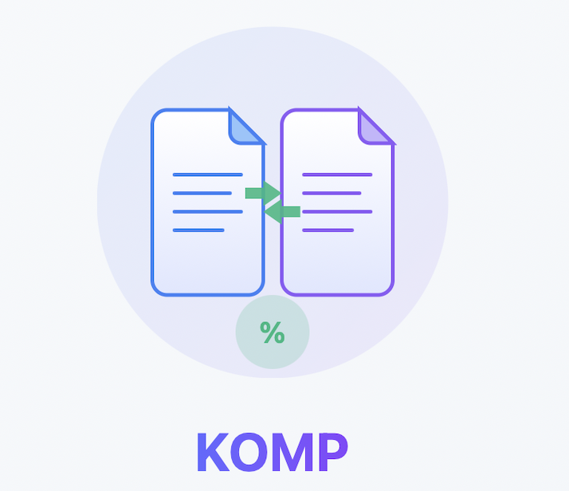
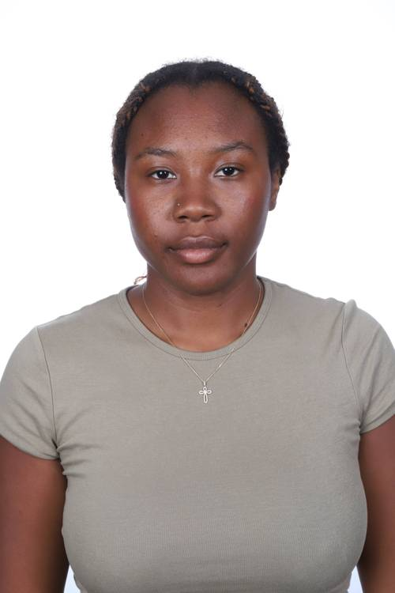
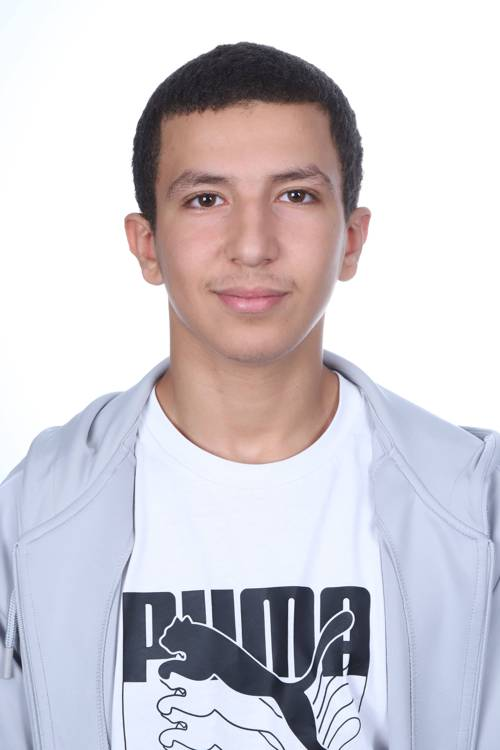

<p align="center">
  
</p>

<h1 align="center">KOMP</h1>

<p align="center">
  <strong>Outil intelligent de comparaison de fichiers — Textes, Code source & Images</strong>
</p>

<p align="center">
  
  
  
  
</p>

<p align="center">
  <a href="#-fonctionnalités">Fonctionnalités</a> •
  <a href="#-algorithmes">Algorithmes</a> •
  <a href="#-installation">Installation</a> •
  <a href="#-utilisation">Utilisation</a> •
  <a href="#-architecture">Architecture</a> •
  <a href="#-équipe">Équipe</a>
</p>

---

## À propos

**KOMP** est un logiciel de comparaison de documents par paires développé en **Rust**, conçu pour fournir un **pourcentage de similitude précis** entre différents types de fichiers. Il traite des documents textuels, des codes sources et des images grâce à des algorithmes avancés d'analyse et de hachage.

> Projet académique réalisé dans le cadre du **Semestre 4** (S4) — Développement système en Rust.

---

## Fonctionnalités

### Comparaison de textes
- Comparaison de documents textuels par paires avec calcul de pourcentage de similitude
- Analyse de grandes collections de documents (dizaines de milliers voire millions)
- Détection de doublons et de contenus fortement ressemblants
- Support des documents longs (articles, livres, rapports)

### Comparaison de code source
- Analyse de fichiers de code avec nettoyage intelligent des commentaires
- Suppression automatique des commentaires mono-ligne (`//`, `#`) et multi-lignes (`/* ... */`)
- Comparaison du contenu logique pur du code, indépendamment de la documentation

### Correction orthographique
- Vérification orthographique basée sur la **distance de Levenshtein**
- Mesure précise des écarts entre les mots
- Suggestion de corrections basées sur la proximité lexicale

### Comparaison d'images *(en cours de développement)*
- Détection de similarités visuelles via **hachage perceptuel (pHash)**
- Analyse par **histogrammes de couleurs**
- Support des formats courants (JPEG, PNG)

### Interface graphique
- Interface utilisateur native avec **FLTK** (Fast Light Toolkit)
- Expérience fluide et multiplateforme (Windows, macOS, Linux)

---

## Algorithmes

| Algorithme | Usage | Description |
|---|---|---|
| **K-grammes** | Texte & Code | Décomposition en sous-séquences de *k* caractères pour l'analyse de similitude |
| **Levenshtein** | Orthographe | Distance d'édition minimale entre deux chaînes de caractères |
| **pHash** | Images | Hachage perceptuel pour la comparaison visuelle résistante aux transformations |
| **Histogrammes** | Images | Distribution des couleurs pour la comparaison structurelle des images |

---

## Prérequis

- **Rust** ≥ 1.85 (édition 2024)
- **Cargo** (gestionnaire de paquets Rust)
- **CMake** (requis pour la compilation de FLTK)
- Un compilateur C++ (MSVC sur Windows, GCC/Clang sur Linux/macOS)

---

## Installation

### 1. Cloner le dépôt

```bash
git clone https://github.com/NotSamSam/Projet-Rust.git
cd Projet-Rust
```

### 2. Compiler le projet

```bash
cd komp-compare
cargo build --release
```

### 3. Lancer l'application

```bash
cargo run --release
```

---

## Utilisation

### Comparaison de deux fichiers texte

Placez vos fichiers dans le répertoire du projet, puis lancez KOMP. L'interface graphique vous permet de :

1. **Sélectionner** deux fichiers à comparer
2. **Choisir** le mode de comparaison (texte, code, image)
3. **Lancer** l'analyse et obtenir le pourcentage de similitude

### Exemples fournis

Le projet inclut des fichiers de test pour démonstration :

| Fichier | Description |
|---|---|
| `example1.txt` / `example2.txt` | Deux textes similaires sur l'urbanisation (anglais) |
| `src/doc10.txt` / `src/doc11.txt` | Documents longs pour test de performance |
| `src/code_test_commentaires.txt` | Code C++ avec commentaires pour test de nettoyage |
| `src/exemple_image_1.jpg` / `src/exemple_image_2.jpg` | Paire d'images pour comparaison visuelle |

---

## Architecture

```
Projet-Rust/
│
├── README.md                   # Ce fichier
├── index.html                  # Site vitrine du projet
├── style.css                   # Styles du site vitrine
├── script.js                   # Scripts du site vitrine
├── logo_komp.png               # Logo officiel KOMP
├── Cahier_des_charges_KOMP.pdf # Documentation technique (PDF)
├── .gitignore                  # Fichiers ignorés par Git
│
└── komp-compare/               # Crate Rust principale
    ├── Cargo.toml              # Manifest du projet (dépendances)
    ├── Cargo.lock              # Verrouillage des versions
    │
    └── src/
        ├── lib.rs              # Point d'entrée de la bibliothèque
        ├── basic_methods/      # Module des algorithmes de comparaison
        │   └── k_grams.rs      # Implémentation des k-grammes
        │
        ├── doc10.txt           # Données de test (document long)
        ├── doc11.txt           # Données de test (document long)
        ├── code_test_commentaires.txt  # Données de test (code C++)
        ├── exemple_image_1.jpg # Données de test (image)
        └── exemple_image_2.jpg # Données de test (image)
```

---

## Dépendances

| Crate | Version | Rôle |
|---|---|---|
| [`fltk`](https://github.com/fltk-rs/fltk-rs) | ^1.5 (git) | Interface graphique native multiplateforme |
| [`image`](https://crates.io/crates/image) | 0.24 | Manipulation et analyse d'images (JPEG, PNG, etc.) |

---

## Équipe

<table align="center">
  <tr>
    <td align="center">
      <br />
      <strong>Maywenn KOUSSAWO</strong><br />
      <sub>Project Manager & Design</sub><br />
      <em>Coordination de l'équipe et conception UI</em>
    </td>
    <td align="center">
      <br />
      <strong>Ayoub EL-ASRI</strong><br />
      <sub>Lead Developer Rust</sub><br />
      <em>Moteur de comparaison et architecture</em>
    </td>
    <td align="center">
      <br />
      <strong>Lucas LEFRANC</strong><br />
      <sub>Backend & Algorithmie</sub><br />
      <em>Algorithmes de similitude et optimisation</em>
    </td>
  </tr>
</table>

---

## Site vitrine

Le projet dispose d'un **site vitrine** accessible en ouvrant le fichier `index.html` dans un navigateur. Ce site présente :

- Le projet et ses fonctionnalités
- L'équipe de développement
- Le cahier des charges téléchargeable en PDF
- Les liens vers le dépôt GitHub

---

## Roadmap

- [x] Moteur de comparaison textuelle par k-grammes
- [x] Nettoyage intelligent des commentaires dans le code source
- [x] Interface graphique FLTK
- [x] Site vitrine responsive
- [ ] Intégration complète des empreintes MinHash
- [ ] Comparaison d'images par pHash et histogrammes
- [ ] Export des résultats en CSV / JSON
- [ ] Mode batch pour traitement en masse

---

## Licence

Ce projet est distribué sous licence **MIT**. Voir le fichier `LICENSE` pour plus de détails.

---

## Contribuer

Les contributions sont les bienvenues ! Pour contribuer :

1. **Fork** le dépôt
2. Créez une **branche** pour votre fonctionnalité (`git checkout -b feature/ma-feature`)
3. **Commit** vos changements (`git commit -m "Ajout de ma fonctionnalité"`)
4. **Push** la branche (`git push origin feature/ma-feature`)
5. Ouvrez une **Pull Request**

---

<p align="center">
  <strong>© 2026 KOMP Project</strong><br />
</p>
